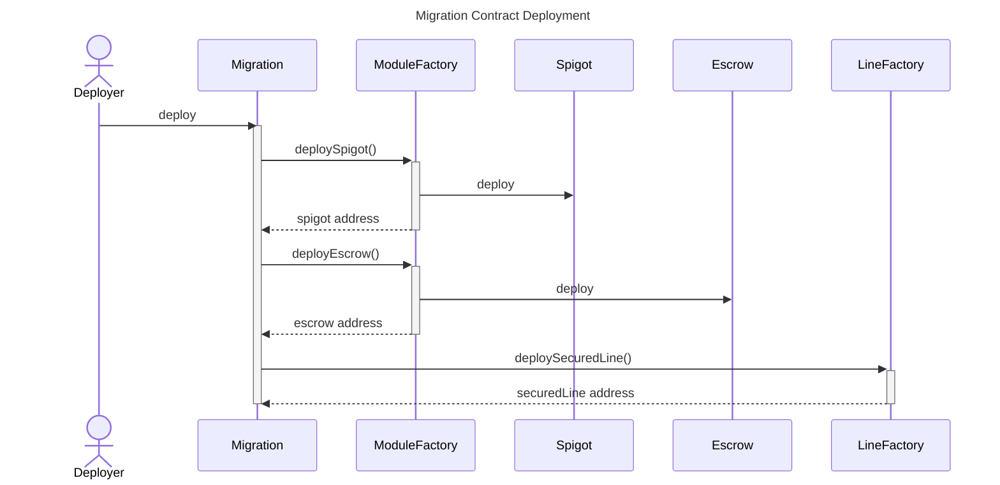
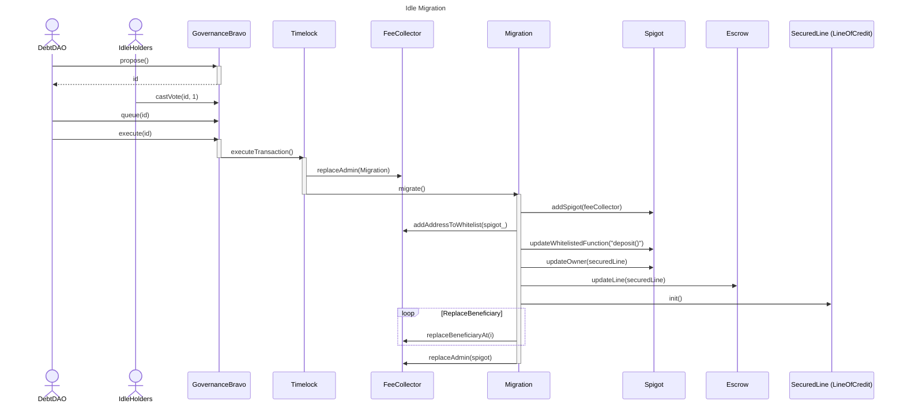
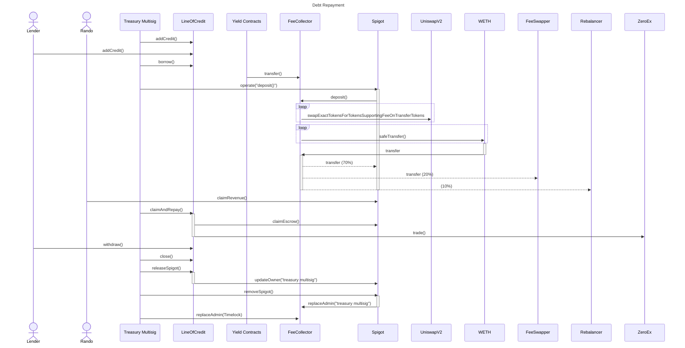

# Idle Migration Sequence

## Deployment

During construction, the migration's Spigot and Escrow contracts are deployed via the Module Factory. The addresses for these newly deployed contracts are then passed in as arguments when deploying the Migration's Secured Line of Credit.

## Migration

The migration is mostly automated and can only be initiated via Idle Finance's governance mechanism. An onchain proposal is submitted, which contains two steps (transactions) that are executed synchronously by the Timelock contract. The first transaction calls the `replaceAdmin` function on the Fee Collector, replacing the Timelock with the Migration contract as the new Admin.

The second part of the proposal performs the migration. As the new admin, the Migration contract sets up the Spigot, adds the Fee Collector as a source of revenue, whitelists the `deposit()` function, transfers ownership of the Spigot and Escrow contracts to the Spigot, initializes the Line of Credit, updates the beneficiaries and their allocations, and in the final step makes the Spigot the admin of the Fee Collector.

