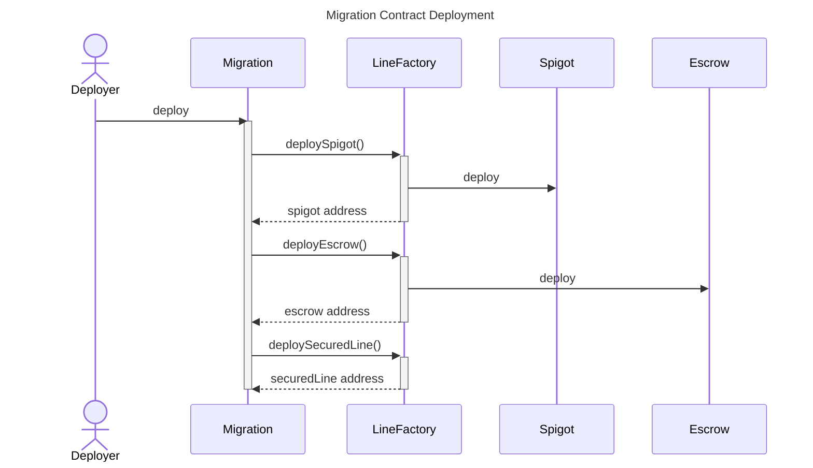
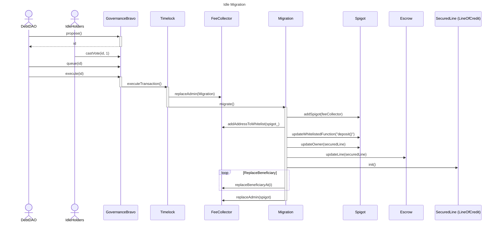
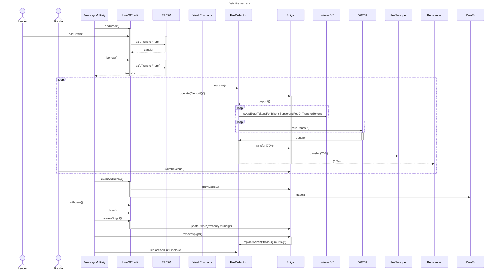

# Idle Migration Sequence

## Deployment

During the contract's construction, the Spigot and Escrow contracts are deployed via the Line Factory. The addresses for these newly deployed contracts are then passed in as arguments when deploying the Migration's Secured Line of Credit.

&nbsp;
---
---
&nbsp;

## Migration Process

The migration is automated and can only be initiated via Idle Finance's governance mechanism. An onchain proposal is submitted, which contains two separate steps (transactions) that are executed synchronously by the Timelock contract if the governance proposal passes. The first transaction calls the `replaceAdmin` function on the Fee Collector, replacing the Timelock with the Migration contract as the new Admin.

The second part of the proposal performs the migration. As the new admin, the Migration contract performs the following tasks:

- configures the Spigot
- adds the Fee Collector as a source of revenue
- whitelists the `deposit()` function
- transfers ownership of the Spigot and Escrow contracts to the Secured Line of Credit
- initializes the Line of Credit
- updates the beneficiaries and their allocations
- and in the final step makes the Spigot the admin of the Fee Collector, thus enabling the spigots functionality and control over the protocol and thus debt repayment.

---
---
&nbsp;
## Debt Repayment

Once a lender and the borrower (Idle Finance) have been matched, each party calls `addCredit()` on the Line of Credit, passing the same parameters - which are required by the Line Of Credit's `Mutual Consent` mechanism.  The Lender is the first to call the function, after which it is called by the borrower, thus facilitating the transfer of funds to the Line Of Credit contract.

The borrower is then able to draw down on the available credit by calling `borrow()` on the Line of Credit.

Over time, the Idle Finance protocol generates fees which accrue to the Fee Collector.  In order to distribute this revenue, the operator (Idle Treasury Multisig) calls `operate()` on the Spigot, passing in the previously whitelisted `deposit()` function along with the required `calldata`.  This triggers the Fee Collector to trade the held tokens for Weth, and distribute them to the beneficiaries according to their allocation percentages.

Once significant revenue has been generated, the borrower calls `claimAndRepay` on the Line of Credit. This claims the revenue tokens from the Spigot (via `claimEscrow()` ) and trades them for the original credit tokens via a Dex Aggregator (0x Protocol) and uses the newly purchased credit tokens to repay the debt.

The lender then reclaims their principal, along with accrued interest, by calling `withdraw()` on the Line of Credit. The borrower (Idle Treasure Multisig) then closes the Line of Credit by calling `close()`, and releases the Spigot by calling `releaseSpigot()` (also on the Line of Credit). This triggers the transfer of ownership of the Spigot to the Treasury League Multisig (borrower). The borrower is then able to call `removeSpigot()` on the Spigot, which internally calls `replaceAdmin()` on the Fee Collector, setting the Idle Treasury League Multisig as the new Fee Collector's admin.  The final step is for the Idle Treasury League multisig to call `replaceAdmin()` on the Fee Collector, restoring the Timelock contract as the admin.

