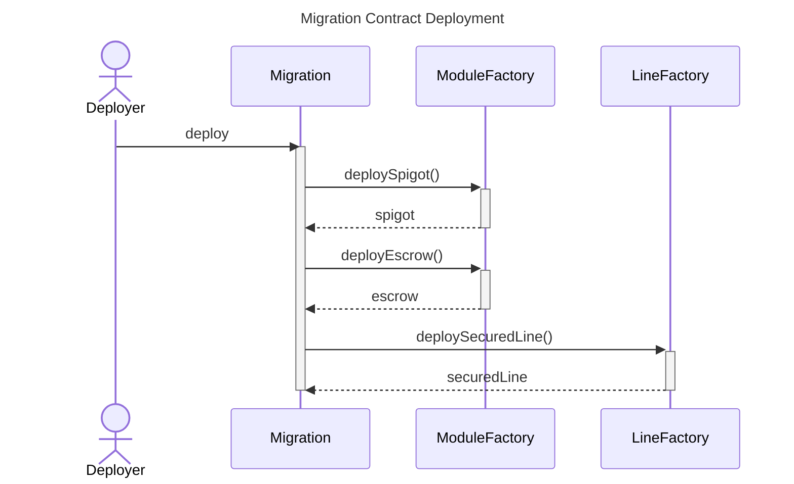
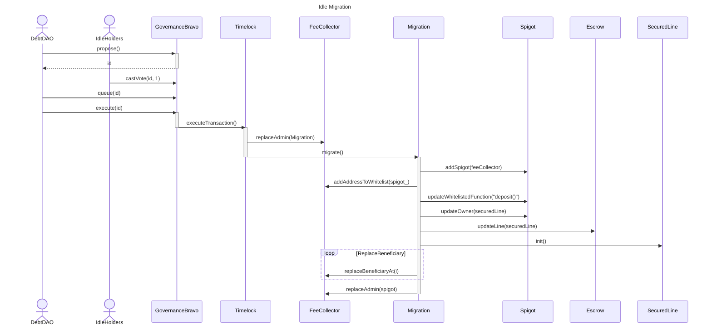

# Idle Migration Sequence

## Deployment

```mermaid
sequenceDiagram
    title Migration Contract Deployment

    actor Deployer
    Deployer ->> Migration: deploy
    activate Migration
    Migration ->>+ ModuleFactory: deploySpigot()
    ModuleFactory -->>- Migration: spigot
    Migration ->>+ ModuleFactory: deployEscrow()
    ModuleFactory -->>- Migration: escrow
    Migration ->>+ LineFactory: deploySecuredLine()
    LineFactory -->>- Migration: securedLine
    deactivate Migration

```

## Migration

```mermaid
sequenceDiagram
    title Idle Migration

    actor DebtDAO
    actor IdleHolders
    DebtDAO ->>+ GovernanceBravo: propose()
    GovernanceBravo -->>- DebtDAO: id
    IdleHolders ->> GovernanceBravo: castVote(id, 1)
    DebtDAO ->> GovernanceBravo: queue(id)
    DebtDAO ->> GovernanceBravo: execute(id)
    activate GovernanceBravo
    GovernanceBravo ->> Timelock: executeTransaction()
    deactivate GovernanceBravo
    activate Timelock
    Timelock ->> FeeCollector: replaceAdmin(Migration)
    Timelock ->> Migration: migrate()
    deactivate Timelock
    activate Migration
    Migration ->> Spigot: addSpigot(feeCollector)
    Migration ->> FeeCollector: addAddressToWhitelist(spigot_)
    Migration ->> Spigot: updateWhitelistedFunction("deposit()")
    Migration ->> Spigot: updateOwner(securedLine)
    Migration ->> Escrow: updateLine(securedLine)
    Migration ->> SecuredLine: init()
    loop ReplaceBeneficiary
        Migration ->> FeeCollector: replaceBeneficiaryAt(i)
    end
    Migration ->> FeeCollector: replaceAdmin(spigot)
    deactivate Migration

```
